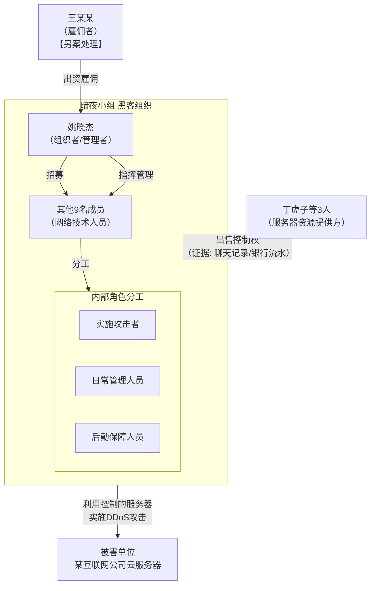

# 姚晓杰等11人破坏计算机信息系统案
## 主要案件事实

1、犯罪主体: 姚晓杰、丁虎子等11人组成的“暗夜小组”黑客组织。

2、犯罪行为：接受雇佣，购买服务器资源，利用木马操控服务器对某互联网公司云服务器发起DDoS攻击，导致三家游戏公司服务瘫痪。

3、危害后果: 云服务器无法正常运行，被害公司支付4万余元抢修费用。

## 争议要点
1、DDOS 攻击行为和云服务器出现无法登录、用户频繁掉线是否存在因果关系？
公诉人认为：“案发时并不存在其他大规模网络攻击，在案证据足以证实只有“暗夜小组”针对云服务器进行了DDoS高流量攻击，每次的攻击时间和被攻击的时间完全吻合，攻击手法、流量波形、攻击源IP和攻击路径与被告人供述及其他证据相互印证，现有证据足以证明三家网络游戏公司客户端不能正常运行系受“暗夜小组”攻击导致。”
根据调查结果，整个攻击过程存在近20万个攻击源IP，而查证属实的被告人控制的 IP 仅仅198个，而 DDOS 攻击普遍具有海量 IP 的特点，不能因为 案发时不存在其他大规模网络攻击即认定被害人游戏无法正常登陆的结果系被告人行为导致。

同时，本案被害人的服务器部署在云端，按照现在主流云端服务器的日志能力，完全有能力记载已查实198个 IP 涉及的网络流量，是否足以导致案涉游戏服务器无法运行。从案例中也未看到辩护人通过此路径调取相关证据。

2、抢修费用（包含员工工资）是否应认定为“经济损失”？
包括危害计算机信息系统犯罪行为给用户直接造成的经济损失，以及用户为恢复数据、功能而支出的必要费用。该条明确规定了危害计算机信息系统安全犯罪中的经济损失是指犯罪行为所造成的直接经济损失。而员工工资，并非是经济损失
破坏计算机信息系统最的认定以后果严重为构成要件，后果严重的结果的认定条件即包含造成经济损失一万元以上的。本案是虽然可以讲员工工资认定为经济损失。但是没有看到公诉人举证具体的损失构成的相关证据。
 退一步说，如果员工工资可以认定为“直接经济损失”，那么可以从实际处理事故的人员工资、时长上为突破口，反驳实际损失并未达到量刑标准。
